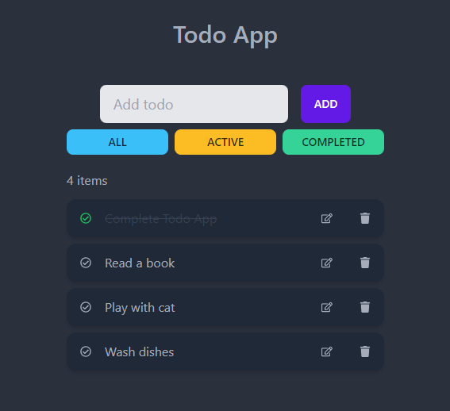

# Todo App

## Stack:

[React](https://reactjs.org/)\
[Daisy UI](https://daisyui.com/)\
[Tailwind CSS](https://tailwindcss.com/)\
[JSON Server](https://www.npmjs.com/package/json-server)

---

## Usage

### Install dependencies

```bash
npm install
```

### Run

```bash
npm run dev
```

This will run JSON-server on port :6000 and React on port :3000

